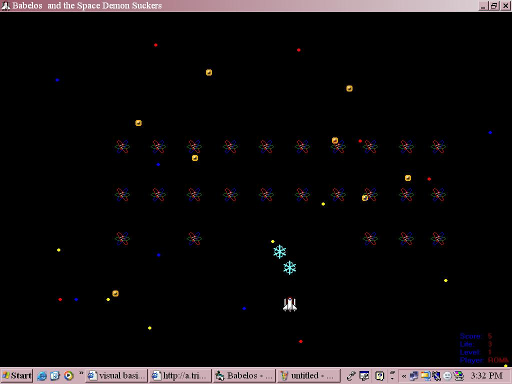



## Babelos

### Description

This Vb Program demonstrates the basics of computer game development.How to use sprites in animation. Detect Object collisions and the fantastic use of your imagination.

Hope you'll like this program and learn something from it. Please rate..:)
 
### More Info
 

             |
---                |---
**Submitted On**   |2005-12-19 15:23:52
**By**             |[Rommel A\. Suarez](https://github.com/Planet-Source-Code/PSCIndex/blob/master/ByAuthor/rommel-a-suarez.md)
**Level**          |Intermediate
**User Rating**    |5.0 (10 globes from 2 users)
**Compatibility**  |VB 3\.0, VB 4\.0 \(16\-bit\), VB 4\.0 \(32\-bit\), VB 5\.0, VB 6\.0
**Category**       |[Games](https://github.com/Planet-Source-Code/PSCIndex/blob/master/ByCategory/games__1-38.md)
**World**          |[Visual Basic](https://github.com/Planet-Source-Code/PSCIndex/blob/master/ByWorld/visual-basic.md)
**Archive File**   |[Babelos19578312192005\.zip](https://github.com/Planet-Source-Code/rommel-a-suarez-babelos__1-63713/archive/master.zip)

